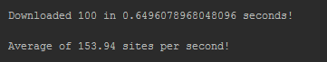

# Python_Concurrency

Programa para testar e demonstrar o conceito de paralelismo, para executar códigos mais rapidamente por algumas abordagens diferentes.

## Download Síncrono

O primeiro exemplo é o download do conteúdo de websites pela forma normal (ou mais fácil), onde um download é finalizado antes de outro ser iniciado.

O nome do arquivo é **downloadsites_synchronous.py**.

Na minha máquina pessoal, o tempo de execução de download de 100 websites foi de 18.61 segundos, ou seja, 5.37 downloads por segundo.

Output do código:

Como podemos ver, o código é extremamente simples. Porém é um pouco demorado.

## Download Assíncrono utilizando Threading

O segundo exemplo é o download do conteúdo de websites utilizando threading, onde a tarefa de download é dividida entre vários *workers* (ou trabalhadores) para que os downloads sejam realizados em paralelo.
Na minha máquina pessoal, o tempo de execução de 100 websites foi de 1.72 segundos, ou seja, 58.09 downloads por segundo! Isso equivale à uma melhora de aproximadamente 90,76% em tempo de execução!
Output do código:

